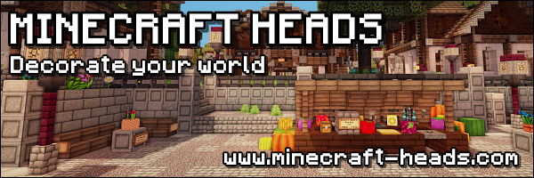

# HeadCommands

HeadCommands is a Bukkit/Paper plugin for loading heads from Minecraft-Heads.com. Heads are cached in a configurable MySQL database. It provides commands to list categories, search heads inside a category, and give a head by its known Minecraft-Heads ID.

Head data and textures are provided by [Minecraft-Heads.com](https://minecraft-heads.com/).
[](https://minecraft-heads.com/)

## Features

- Caches Minecraft-Heads.com categories and custom heads in MySQL.
- Searches cached heads by category and name tokens.
- Lists clickable chat results that run `/headcommands give <id>`.
- Creates player heads locally from cached texture URLs.

## Requirements

- Paper or compatible Bukkit server for Minecraft 1.21.11.
- Java 21.
- CubesideUtils.
- MySQL-compatible database.
- Minecraft-Heads.com free or better API key.

## Configuration

Copy the plugin jar to the server plugins folder, start the server once, and edit `plugins/HeadCommands/config.yml`.

Configure:

- `database.host`, `database.user`, `database.password`, `database.database`, `database.tableprefix`
- `api.baseUrl`
- `api.apiKey`
- `settings.refreshOnEnable`
- `settings.resultsPerPage`

Without a valid free API key, remote refresh is disabled and the plugin keeps using any existing database cache.

## Commands

- `/headcommands categories [page]` lists cached categories.
- `/headcommands search <categoryId|categoryName> <query...>` searches heads in one category.
- `/headcommands give <id> [amount]` gives the executing player a cached head.
- `/headcommands refresh` refreshes the database cache from Minecraft-Heads.com.
- `/headcommands reload` reloads config and database cache.

`/heads` is an alias for `/headcommands`.

## Build

```sh
mvn package
```

The plugin jar is written to `target/HeadCommands.jar`.

## License

HeadCommands is licensed under the BSD 2-Clause License. See [LICENSE.md](LICENSE.md).
